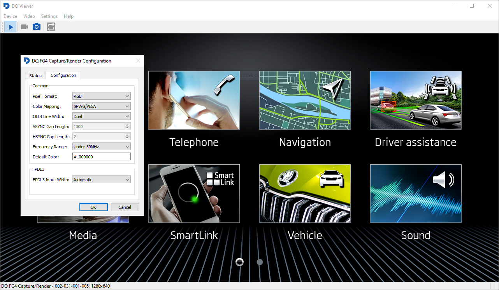

# DQ Viewer



DQ Viewer is a simple video player especially designated for playing video
streams from Digiteq Automotive
[FG4](https://www.digiteqautomotive.com/en/products/grabbers-and-image-tools/framegrabber-4)
grabber cards and
[MGB](https://www.digiteqautomotive.com/en/products/grabbers-and-image-tools/modular-framegrabber-mgb)
devices.

## Features
* Play local cameras streams (DirectShow / video4linux).
* Play network streams with predefined setup for MGB devices.
* Record the streams to h264 or MPEG2.
* Stream videos to video outputs.
* Capture video frames snapshots to PNG.
* Configure FG4 devices.
* Available for Windows & Linux.

## Build
Build requirements:
* Qt5 >= 5.15 or Qt6
* libVLC

Build steps:
```shell
qmake dqview.pro
make
```

For a complete Windows installer build you may use the provided `dqview.nsi` NSIS
script like in the _Windows_ GitHub Action. For a Linux RPM package build you may
use the `scripts/make-rpm.sh` shell script.

## Known Issues
* Due to libVLC missing Wayland integration support, DQ Viewer must be run with
  explicitly setting the xcb Qt platform on Wayland: "`dqview --platform xcb`"
* The pixel format selection on Linux is broken in the current libVLC version
  (3.0.21) - YUV is always used regardles what is selected.
  A [fix](https://code.videolan.org/videolan/vlc/-/merge_requests/6463) will be
  available in the next libVLC release (3.0.22).
* YUYV 4:2:2 as used by the FG4 devices has distorted quality when the OpenGL
  or Direct3D libVLC video output plugins are used
  ([VLC bug #28897](https://code.videolan.org/videolan/vlc/-/issues/28897)).

## License
DQ Viewer is licensed under GPL-3.0 (only).
On Windows DQ Viewer uses the DirectShow
[base classes](https://learn.microsoft.com/en-us/windows/win32/directshow/directshow-base-classes)
licensed under the MIT license.
